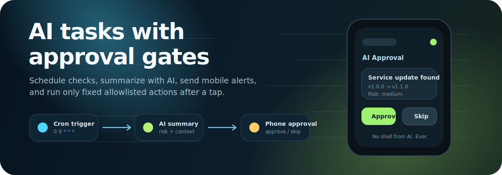
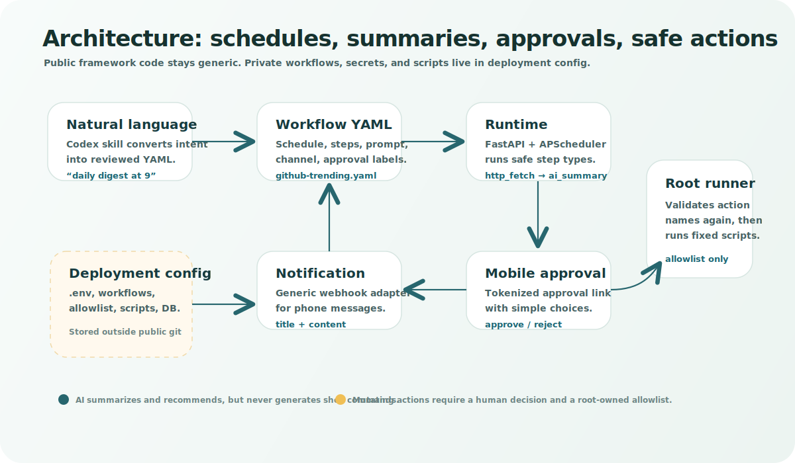
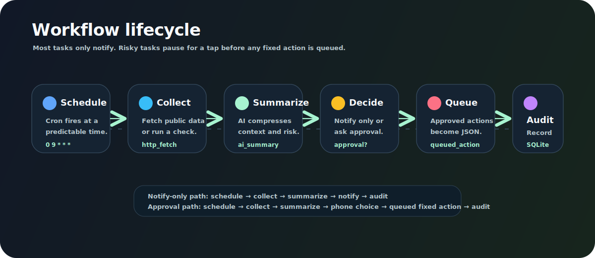
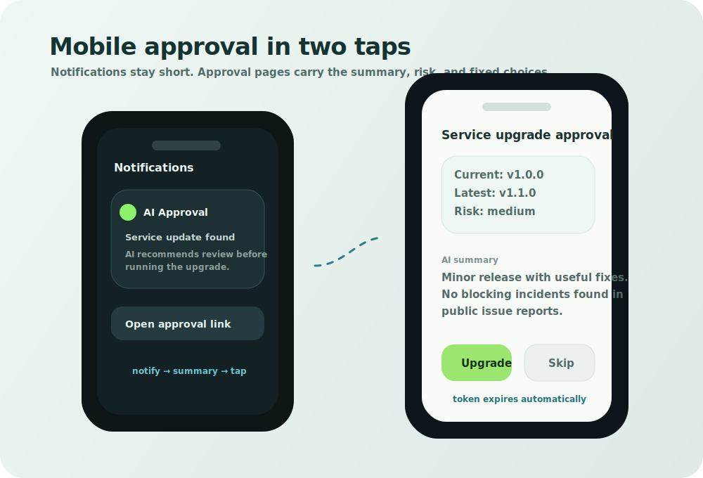
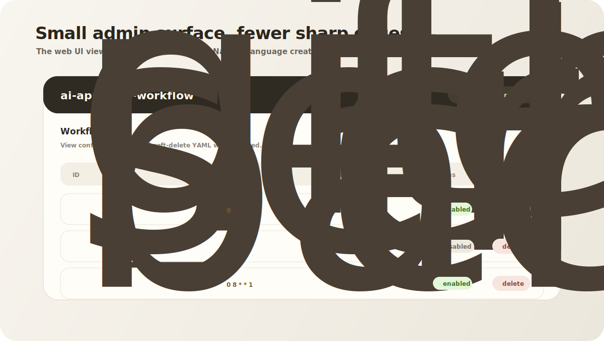

# ai-approval-workflow

[English](README.md) | [简体中文](README.zh-CN.md)



Open-source scheduled AI workflow runtime with mobile-first approvals.

`ai-approval-workflow` is for repetitive work that follows this pattern:

```text
something should be checked regularly
  -> AI can read and summarize the result
  -> you only want to be interrupted when a decision is needed
  -> any real action must be fixed, reviewed, and allowlisted
```

It is intentionally **not** a chat bot and **not** a visual workflow builder. Natural-language task creation/editing/deletion is handled by the bundled Codex skill, which writes reviewable YAML workflow files.

## Why this exists

Most automation tools are either too silent or too dangerous:

- cron jobs run without enough context;
- chat bots require long conversations for simple decisions;
- AI agents can be risky if they directly execute arbitrary commands;
- human reviewers do not want another dashboard to monitor all day.

This project keeps the useful middle ground: **scheduled AI summaries + simple phone approval + fixed allowlisted actions**.

## What it can do

- Run scheduled AI tasks from YAML cron definitions.
- Fetch public pages or run named read-only checks.
- Summarize long output into short phone-friendly messages.
- Ask for mobile approval with simple buttons such as Upgrade / Skip.
- Queue approved actions for a root-side runner that validates names again.
- Provide a small admin page for viewing and soft-deleting configured tasks.
- Let a Codex skill convert natural language into reviewed workflow YAML.

## How it works



The public repository contains the generic framework. Your private deployment keeps secrets, production workflows, action allowlists, scripts, and databases outside git.



## Product surfaces

Mobile approval:



Admin page:



## Real-world use cases

- **GitHub Trending digest:** summarize interesting repositories every morning.
- **Service upgrade review:** check versions and known issues, then ask whether to upgrade.
- **Certificate/domain expiry watcher:** notify before something important expires.
- **Backup health report:** turn raw backup logs into a weekly risk summary.
- **CI failure triage:** group failures and suggest the next action.
- **Billing/subscription drift:** summarize unusual spend or upcoming renewals.
- **Personal convenience tasks:** price drops, travel disruption summaries, policy updates, and home server health.

See [Use Cases](docs/use-cases.md) for concrete examples, including a sanitized real-world upgrade approval case.

## Quick start

```bash
python3 -m venv .venv
source .venv/bin/activate
pip install -e '.[dev]'
cp .env.example .env
pytest -q
uvicorn ai_approval_workflow.main:app --host 127.0.0.1 --port 8787
```

Open:

- `http://127.0.0.1:8787/healthz` for health checks;
- `http://127.0.0.1:8787/admin` for viewing and soft-deleting workflows.

## Workflow files

Workflow YAML files live in `AAW_WORKFLOWS_DIR`. Validate them before restart:

```bash
.venv/bin/python scripts/validate_workflows.py ./examples
```

Common MVP step types:

- `http_fetch`: GET a public URL and store response text for AI;
- `ai_summary`: summarize the latest task/fetch result;
- `notify`: send a notification through the configured webhook;
- `approval`: create a mobile approval page with simple choices;
- `command_check`: run a named read-only command from private allowlist config;
- `queued_action`: enqueue an approved named action for a root-side runner;
- `demo_summary` / `demo_action`: safe local demo steps.

Examples:

- `examples/github-trending-daily.yaml`: notification-only GitHub Trending digest;
- `examples/service-upgrade-watch.yaml`: generic service upgrade check with approval and queued action.

## Natural-language workflow management

The bundled Codex skill lives in:

```text
skills/ai-approval-workflow/SKILL.md
```

Install or copy it into `$CODEX_HOME/skills/ai-approval-workflow/`, then use prompts such as:

- “每天早上 9 点给我发 GitHub Trending 总结，不需要审批”
- “每天检查某个服务版本，如果值得升级就发手机审批，按钮是升级/跳过”
- “删除某个定时任务”

The skill should keep private hostnames, tokens, scripts, and production workflow files outside this public repository.

## Private overlay

This repository is safe to publish when used as a framework. Your deployment-specific data should stay outside git:

- `.env` and any `.env.*` files;
- production workflow files under `/etc/ai-approval-workflow/workflows` or another private directory;
- action allowlists such as `/etc/ai-approval-workflow/actions.yaml`;
- root-owned scripts used by `command_check` or `queued_action`;
- SQLite databases and action queue files.

See [Private Overlay](docs/private-overlay.md) and [Publishing Checklist](docs/publishing-checklist.md) before publishing.

## Documentation

- [Use Cases](docs/use-cases.md)
- [Design](docs/design.md)
- [Security Model](docs/security.md)
- [Deployment](docs/deployment.md)
- [Action Runner](docs/action-runner.md)
- [Private Overlay](docs/private-overlay.md)
- [Publishing Checklist](docs/publishing-checklist.md)

## License

MIT.
